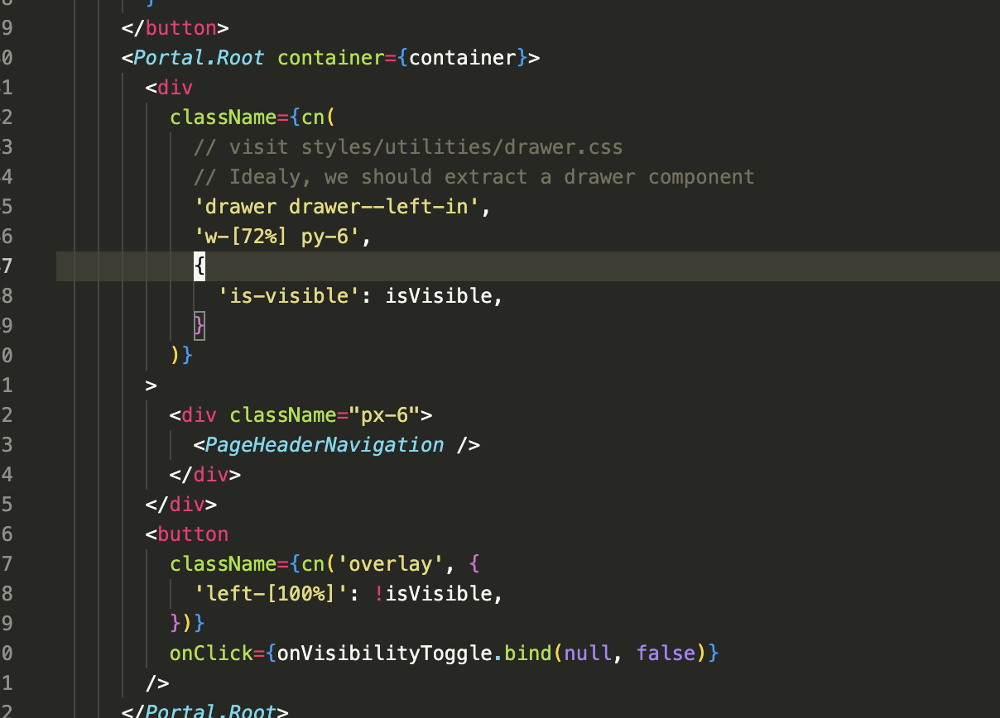

# README

- [Live preview link](https://freedom-press-sample.netlify.app/)
- [Video presentation about the code detail](https://www.loom.com/share/84716b55b0e24ea191222d9b263f2342)

The code is built from [my `nextjs` boilerplate](https://github.com/reboottime/next-boilerplate)

## Why `Radix UI`, `Tailwind` and `Next.js`

- HTML code with tailwind looks messy at first sight, yet it is powerful
  - customize our theme and responsive breaking points using directives and [tailwind.config.js](./tailwind.config.js)
  - Dead code is removed in the CSS output file
  - organize code systematically
    - by reusable [utilities](./styles/utilities)
    - by [ui components](./components/ui/separator.tsx)
    - by grouping tailwind utility class names via [tailwind merge](./components/ui/cn.ts), for example: \\
      
- Radix UI is an excellent React cornerstone component system
  - we can use it to compose other components based on it
  - Headless, we can apply theming on it using our design system
  - copycats code snippets by [`shadcn/ui`](https://github.com/shadcn-ui/ui)
- Why `Next.js`: Server-side rendering uses React
  - Three of our websites are customer facing which require good loading speed and SEO, and one of them is a CMS press website
  - working with React components and component systems means isolation on need, which could boost maintainability
